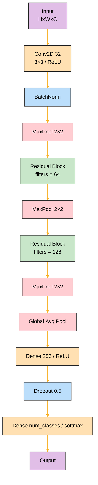

```mermaid
%%{
  init: {
    'theme': 'base',
    'themeVariables': {
      'primaryColor': '#BB2528',
      'primaryTextColor': '#000',
      'primaryBorderColor': '#7C0000',
      'lineColor': '#F8B229',
      'secondaryColor': '#006100',
      'tertiaryColor': '#fff'
    }
  }
}%%
flowchart TD
  %% Classes
  classDef conv  fill:#FFE0B2,stroke:#333;
  classDef norm  fill:#BBDEFB,stroke:#333;
  classDef pool  fill:#FFCDD2,stroke:#333;
  classDef res   fill:#C8E6C9,stroke:#333;
  classDef op    fill:#E1BEE7,stroke:#333;

  %% Nodes
  Input[Input<br/>H×W×C]:::op
  Conv1[Conv2D 32<br/>3×3 / ReLU]:::conv
  BN1[BatchNorm]:::norm
  Pool1[MaxPool 2×2]:::pool

  Res64[Residual Block<br/>filters = 64]:::res
  Pool2[MaxPool 2×2]:::pool

  Res128[Residual Block<br/>filters = 128]:::res
  Pool3[MaxPool 2×2]:::pool

  GAP[Global Avg Pool]:::pool
  FC1[Dense 256 / ReLU]:::conv
  DO[Dropout 0.5]:::norm
  FC2[Dense num_classes / softmax]:::conv
  Output[Output]:::op

  %% Flow
  Input --> Conv1 --> BN1 --> Pool1
  Pool1 --> Res64 --> Pool2
  Pool2 --> Res128 --> Pool3
  Pool3 --> GAP --> FC1 --> DO --> FC2 --> Output
```
